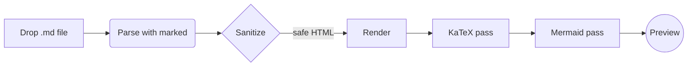
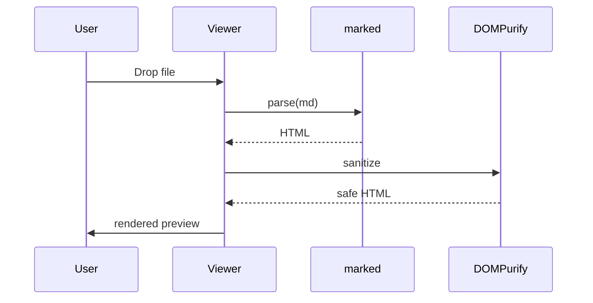

# Markdown Viewer — Sample Document

A small fixture exercising every feature this viewer claims to support.

## Headings, paragraphs, links

This is a paragraph with **bold**, *italic*, ~~strikethrough~~, and a [link to the portal](https://vinovator.github.io/my-ai-tools/).

> A blockquote.
> Multiple lines flow together.

---

## GFM Tables

| Tool | Stack | LOC |
| --- | :---: | ---: |
| trig-viz | React + Canvas | ~600 |
| pdf-play | pdf-lib + JSZip | 1365 |
| md-viewer | marked + KaTeX + Mermaid | ~700 |

## Task list

- [x] Render Markdown
- [x] Syntax-highlight code
- [ ] Conquer the world

## Syntax-highlighted code

```js
function fib(n) {
  if (n < 2) return n;
  return fib(n - 1) + fib(n - 2);
}
console.log(fib(10));
```

```python
def primes(limit):
    sieve = [True] * (limit + 1)
    for i in range(2, int(limit ** 0.5) + 1):
        if sieve[i]:
            for j in range(i * i, limit + 1, i):
                sieve[j] = False
    return [i for i in range(2, limit + 1) if sieve[i]]
```

```bash
brew upgrade && claude --version
```

Inline code looks like `const x = 42;`.

## Math (KaTeX)

Inline math: $E = mc^2$ and the quadratic formula $x = \frac{-b \pm \sqrt{b^2 - 4ac}}{2a}$.

Display math:

$$
\int_0^\infty e^{-x^2}\,dx = \frac{\sqrt{\pi}}{2}
$$

$$
\sum_{n=1}^{\infty} \frac{1}{n^2} = \frac{\pi^2}{6}
$$

## Mermaid diagram





## Image


## XSS sanity check (should NOT execute)

The next two lines try to inject script — they should appear inert:

<script>alert('xss')</script>


---

*End of sample.*
